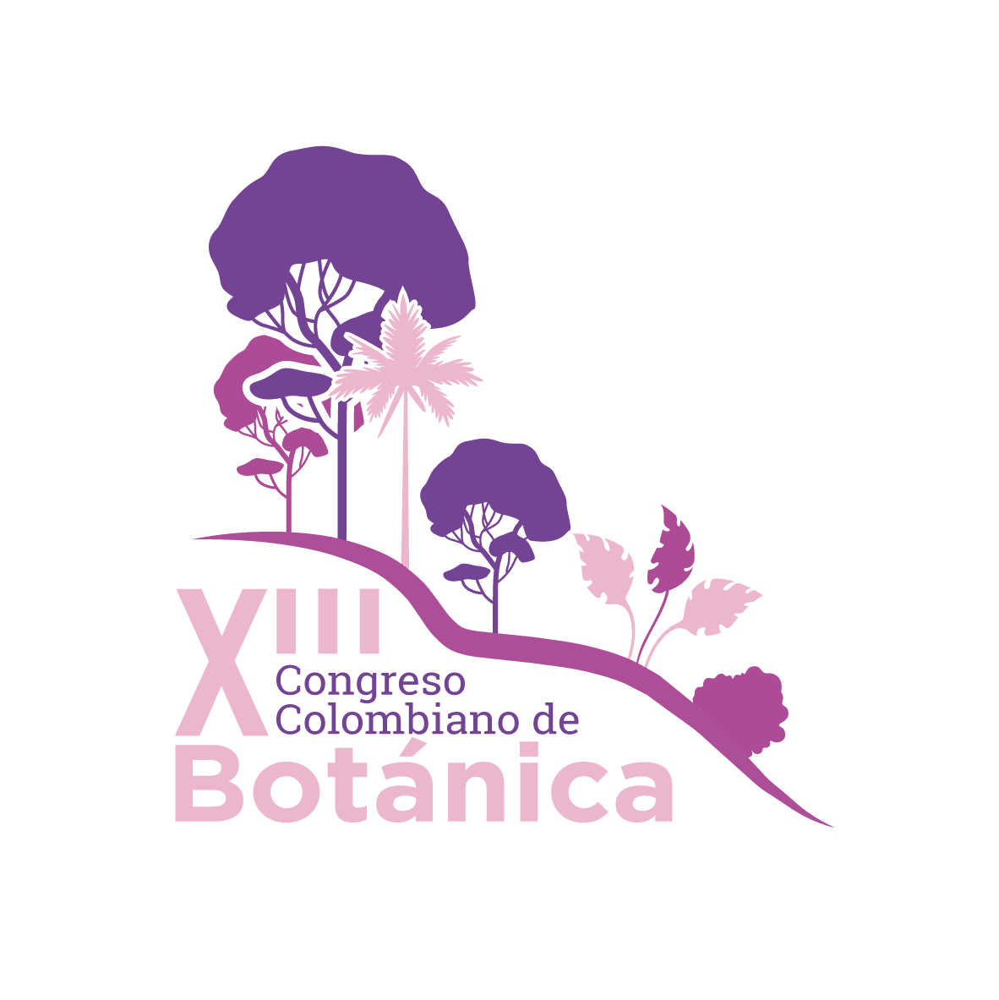

{fig-align="center"}

Del 5 al 9 de octubre de 2026 será el [XIII Congreso Colombiano de Botánica](https://acb.org.co/xiiiccb2026/) en Medellín, Colombia. Estaremos presentes con una variedad de actividades.

<!-- ## Cursos -->

<!-- Conoce todos los detalles haciendo clic en el nombre o en la imagen del curso. -->

<!-- ::::: {.center-text} -->
<!-- :::: {.grid} -->
<!-- ::: {.g-col-12 .g-col-md-6} -->

<!-- ### [Etnobotánica Cuantitativa en R](https://geobota.github.io/xii-ccb-etnobotanica/) -->

<!-- \ -->

<!-- [{fig-align="center"}](http://geobota.github.io/xii-ccb-etnobotanica/) -->

<!-- ::: -->
<!-- ::: {.g-col-12 .g-col-md-6} -->

<!-- ### [Del informe al dato](http://geobota.github.io/xii-ccb-aerobiologia/) -->

<!-- \ -->

<!-- [{fig-align="center"}](http://geobota.github.io/xii-ccb-aerobiologia/) -->

<!-- ::: -->
<!-- :::: -->
<!-- ::::: -->

<!-- ## Simposios {#sec-simposios} -->

<!-- ## Ponencias {#sec-presentations} -->

<!-- ::: {#presentations} -->
<!-- ::: -->

<!-- ## Pósters {#sec-posters} -->

<!-- ::: {#posters} -->
<!-- ::: -->
